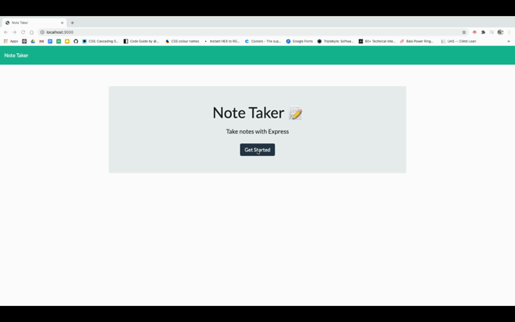

# Note Taker



## Description

For users that need to keep track of a lot of information, it's easy to forget or be unable to recall something important. Being able to take persistent notes allows users to have written information available when needed. The application allows users to write, save, and delete existing notes in order to keep an updated log of information.

The application is built with HTML, CSS, JavaScript, Node.js, and Express.

### User Story

```
AS A user, I want to be able to write and save notes

I WANT to be able to delete notes I've written before

SO THAT I can organize my thoughts and keep track of tasks I need to complete
```

# Table of Contents
[Installation](#installation)

[Usage](#usage)

[Questions](#questions)

# Installation

The application will use an express backend and save/retrieve note data from a JSON file. The user will need to run the commands `npm install` and `npm install express` to begin.

# Usage 

The application is deployed on Heroku.

# Questions

For any questions, please connect with me:

Github username: Jacquelineadean

Github URL: https://github.com/jacquelineadean/

LinkedIn: https://www.linkedin.com/in/jacqueline-dean-968a66150/

Email: Jacquelineadean@gmail.com

